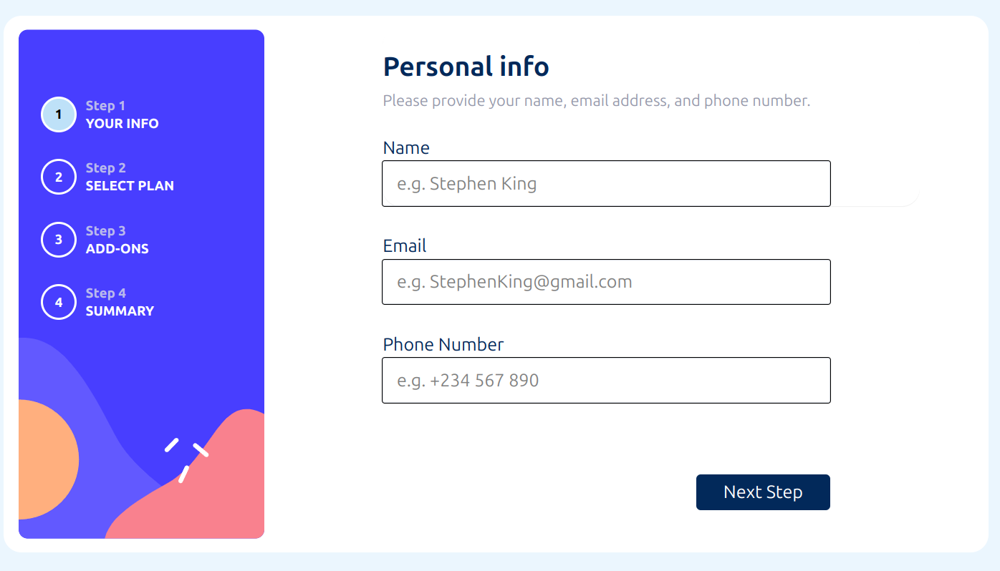
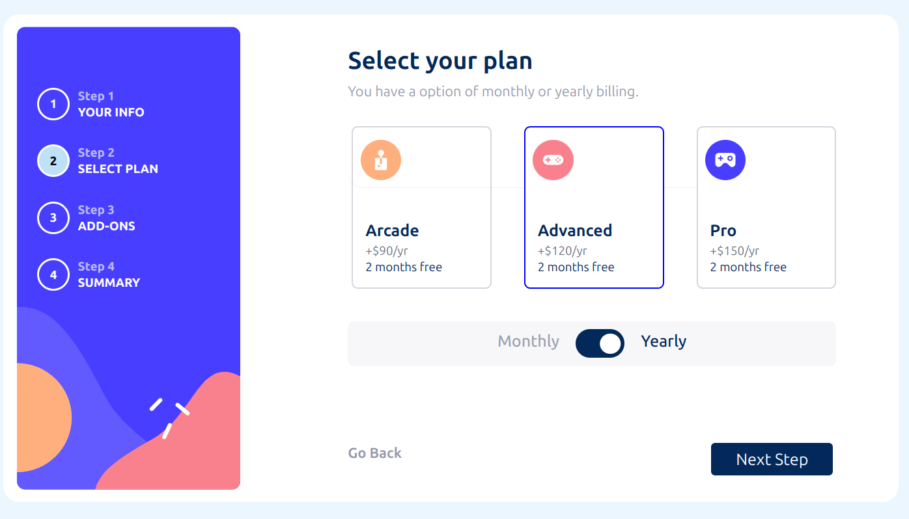
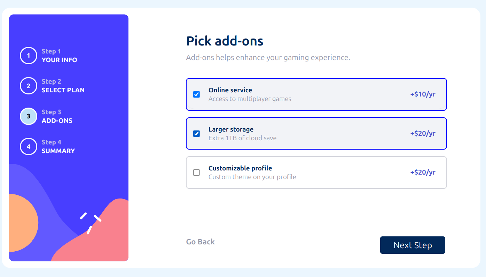
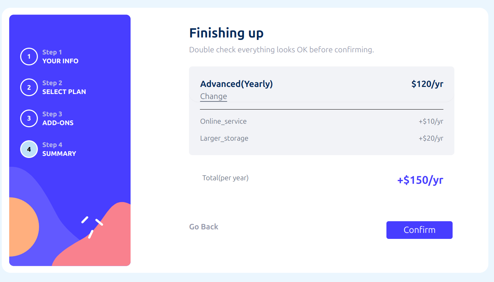
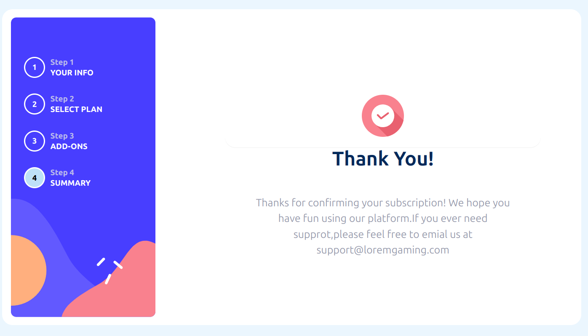

# 🧾 Multi-Step Form

A responsive and accessible multi-step form built with HTML, CSS, and JavaScript. This project guides users through a step-by-step process, allowing them to input information, review their entries, and confirm their submission.

---

## 📖 Overview

This project is a front-end coding challenge that involves creating a multi-step form. The form is designed to be user-friendly and responsive, providing a seamless experience across different devices.

---

## ✨ Features

- **Multi-Step Navigation**: Users can navigate through different steps of the form.
- **Input Validation**: Ensures that users provide the required information in the correct format.
- **Responsive Design**: Optimized for various screen sizes, including mobile, tablet, and desktop.
- **Interactive Elements**: Visual feedback on hover and focus states for better user interaction.
- **Summary Page**: Allows users to review their inputs before final submission.

---

## 🛠️ Technologies Used

- **HTML5**: Markup language for structuring the content.
- **CSS3**: Styling the form and ensuring responsiveness.
- **JavaScript**: Handling form logic, navigation, and validation.

---

## 🚀 Getting Started

 **Clone the repository**:
   ```bash
   git clone https://github.com/K-Ravindhar/multi-step-form.git
   cd multi-step-form
   ```

## 📸 Screenshot













## Link

https://multi-step-form-eight-tau.vercel.app/